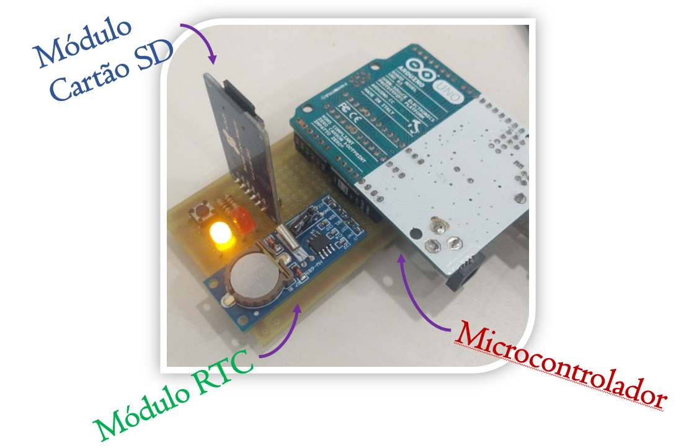

# DataLogger_Project
Código do projeto de um DataLogger com Arduino UNO, para aquisição de dados do veículo Off Road - equipe Bumba Meu Baja

## O hardware

 
:game_die: Além dos componetes mostrados na figura, ele contém um botão para criação de um novo arquivo no cartão de memória e LEDs para visualização de erros no sistema.

## O Software
É capaz de salvar os arquivos lidos por sensores compatíveis com arduino em um cartão de memória para estudos dos resultados em uma máquina.
